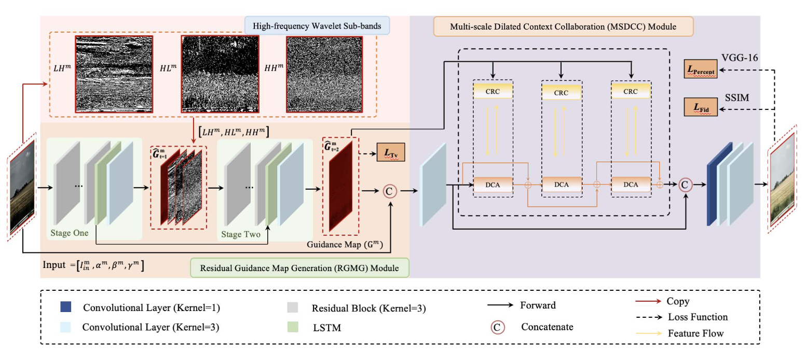
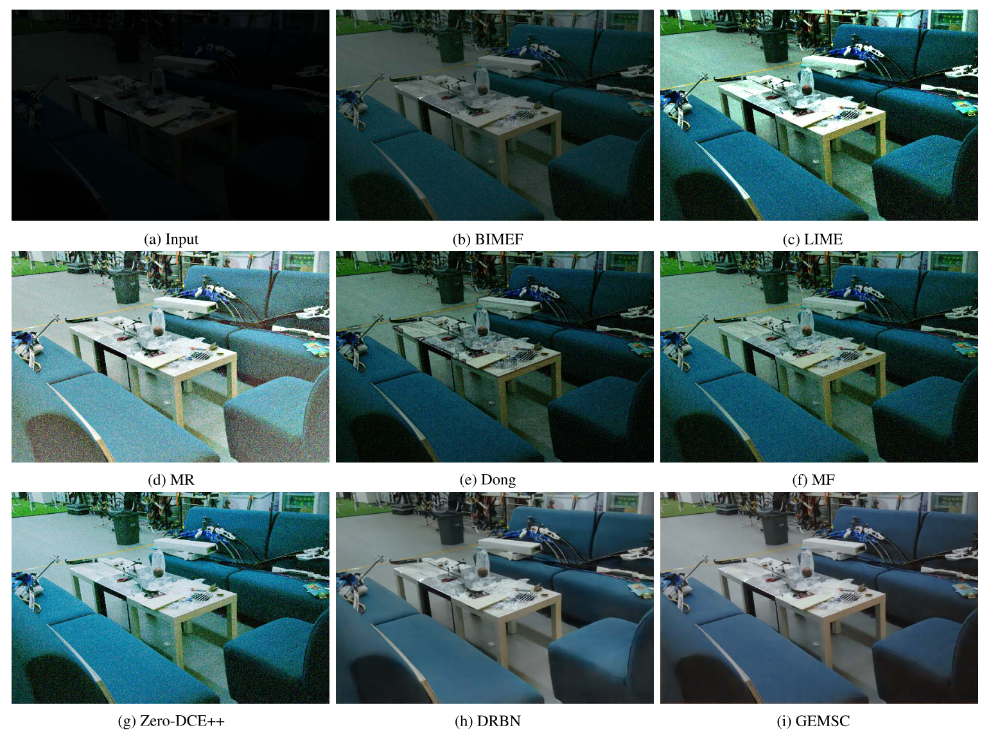
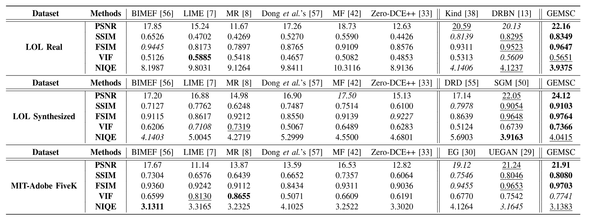

# [TCSVT'22] GEMSC
Official Pytorch implementation of **Enlightening Low-Light Images With Dynamic Guidance for Context Enrichment**.

[Lingyu Zhu](https://scholar.google.com/citations?user=IhyTEDkAAAAJ&hl=zh-CN),
[Wenhan Yang](https://scholar.google.com/citations?user=S8nAnakAAAAJ&hl=zh-CN),
[Baoliang Chen](https://scholar.google.com/citations?user=w_WL27oAAAAJ&hl=zh-CN),
[Fangbo Lu](),
[Shiqi Wang](https://scholar.google.com/citations?user=Pr7s2VUAAAAJ&hl=zh-CN)


[[`Video`](https://www.youtube.com/watch?v=_MkcSFlObcQ&t=36s)] [[`Project Page`]()] [[`Github`](https://github.com/lingyzhu0101/GEMSC)]


## Overview
<p align="left">

</p>

Images acquired in low-light conditions suffer from a series of visual quality degradations, e.g., low visibility, degraded contrast, and intensive noise. These complicated degradations based on various contexts (e.g., noise in smooth regions, over-exposure in well-exposed regions and low contrast around edges) cast major challenges to the low-light image enhancement. Herein, we propose a new methodology by imposing a learnable guidance map from the signal and deep priors, making the deep neural network adaptively enhance low-light images in a region-dependent manner. The enhancement capability of the learnable guidance map is further exploited with the multi-scale dilated context collaboration, leading to contextually enriched feature representations extracted by the model with various receptive fields. Through assimilating the intrinsic perceptual information from the learned guidance map, richer and more realistic textures are generated. Extensive experiments on real low-light images demonstrate the effectiveness of our method, which delivers superior results quantitatively and qualitatively. 

## Qualitative Performance
<p align="left">

</p>


## Quantitative Performance
<p align="left">

</p>


## Public Dataset

We follow the guidance from [CVPR-Semi](https://github.com/flyywh/CVPR-2020-Semi-Low-Light/tree/master)

You can obtain the dataset via: [[Dataset Link]](https://pan.baidu.com/s/1MNVwBVZI1ASglJwoZqj8MQ) (extracted code: odwa) [Updated on 25 April, 2022] <br>
We introduce these collections here: <br>
a) Our_low: real captured low-light images in LOL for training; <br>
b) Our_normal: real captured normal-light images in LOL for training; <br>
c) Our_low_test: real captured low-light images in LOL for testing; <br>
d) Our_normal_test: real captured normal-light images in LOL for testing; <br>
e) AVA_good_2: the high-quality images selected from the AVA dataset based on the MOS values; <br>
f) Low_real_test_2_rs: real low-light images selected from LIME, NPE, VV, DICM, the typical unpaired low-light testing datasets; <br>
g) Low_degraded: synthetic low-light images in LOL for training; <br>
h) Normal: synthetic normal-light images in LOL for training; <br>

## Pytorch version <br>
Only 0.4 and 0.41 currently. <br> If you have to use more advanced versions, which might be constrained to the GPU device types, you might access Wang Hong's github for the idea to replace parts of the dataloader: [[New Dataloader]](https://github.com/hongwang01/RCDNet/tree/master/pytorch1.0%2B/for_syn/src) <br> 


## Example Usage
### Train
see the train command in train.sh

### Test
see the test command in test.sh

We adopt PSNR and SSIM as comparison criteria to evaluate the spatial quality of enhanced video frames, which are based upon the implementations with MATLAB (R2018b).

## Contact

- Lingyu Zhu: lingyzhu-c@my.cityu.edu.hk

## Citation


If you find our work helpful, please consider citing:

```bibtex
@article{zhu2022enlightening,
  title={Enlightening low-light images with dynamic guidance for context enrichment},
  author={Zhu, Lingyu and Yang, Wenhan and Chen, Baoliang and Lu, Fangbo and Wang, Shiqi},
  journal={IEEE Transactions on Circuits and Systems for Video Technology},
  volume={32},
  number={8},
  pages={5068--5079},
  year={2022},
  publisher={IEEE}
}
```

## Additional Link

We also recommend our Unrolled Decomposed Unpaired Network [UDU-Net](https://github.com/lingyzhu0101/low-light-video-enhancement.git). If you find our work helpful, please consider citing:

```bibtex
@inproceedings{,
  title={Unrolled Decomposed Unpaired Learning for Controllable Low-Light Video Enhancement},
  author={Lingyu Zhu, Wenhan Yang, Baoliang Chen, Hanwei Zhu, Zhangkai Ni, Qi Mao, and Shiqi Wang},
  booktitle={European Conference on Computer Vision (ECCV)},
  year={2024}
}
```
We also recommend our Temporally Consistent Enhancer Network [TCE-Net](https://github.com/lingyzhu0101/low-light-video-enhancement.git). If you find our work helpful, please consider citing:
```bibtex
@article{zhu2024temporally,
  title={Temporally Consistent Enhancement of Low-Light Videos via Spatial-Temporal Compatible Learning},
  author={Zhu, Lingyu and Yang, Wenhan and Chen, Baoliang and Zhu, Hanwei and Meng, Xiandong and Wang, Shiqi},
  journal={International Journal of Computer Vision},
  pages={1--21},
  year={2024},
  publisher={Springer}
}
```

